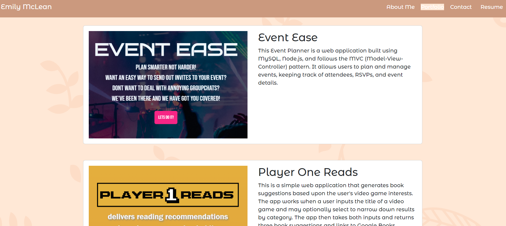
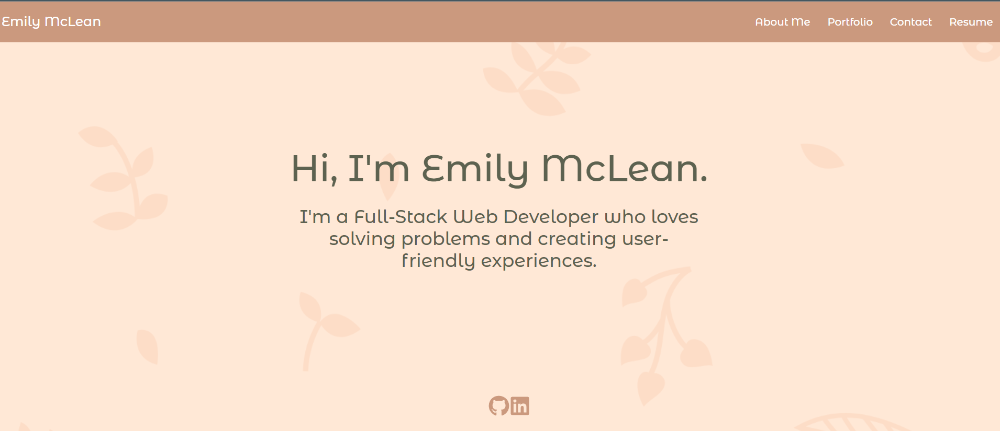

# React Portfolio

My personal portfolio made with React.js

[My Portfolio](#).

## Table of Contents

[Description](#description)

[Screenshots](#screenshots)

[Credits](#credits)

[Questions](#questions)

## Description

A personal portfolio created with React.js that shows my skill in creating dynamic and beautiful applications.

## Screenshots

## Credits

Thank you to my classmates, instructors, and TAs for all the support!

## License

[Click here](https://opensource.org/licenses/MIT) for more information on the license used.

## Questions

[Click Here](https://github.com/emilymclean94) to view my GitHub profile.

